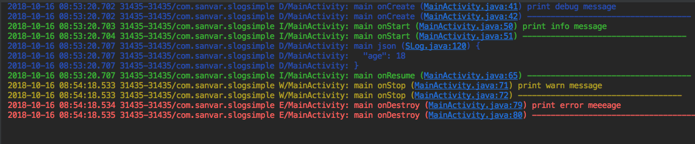

一个日志库，
- 类似 logger ，但是精简掉无用的线。
- 支持json,和xml。
- 支持显示方法名，和线程名。
- 默认打印log所在的文件和行数，支持直接点击行数跳转到文件中。
- 如果不提供TAG,默认使用类名来做TAG。
- 支持打印数组
- 支持直接打印对象，默认调用对象的toString 方法。 

使用方式 

```java 

    @Override
    public boolean isLoggable(int priority) {
        return true; // 开启打印，如果是发布的时候可以关掉
    }

    // 最终日志来到这里统一打印。
    @Override
    public void log(int priority, @Nullable String tag, @NonNull String message) {
        // 不能在这里调用slog ，否则会死循环的。
        Log.println(priority, tag, message);
    }

     @Override
        protected void onCreate(Bundle savedInstanceState) {
            super.onCreate(savedInstanceState);
            setContentView(R.layout.activity_main);
            String path = Environment.getExternalStorageDirectory().getAbsolutePath();
            // 一个可以写文件的printer ，也可以自己实现。
            FilePrinter filePrinter = new FilePrinter(
                    Log.INFO,           // 只将大于 info 级别的日志写入文件。
                    path,               // 文件保存路径
                    2,                  //保存天数
                    false);             // 是否要加密
            Builder b = new Builder();
            b.setTAG(TAG);              // set print tag .
            b.setPrinter(this);         // set printer  / filePrinter
            b.showFunctionInfo(true);   // show func
            b.showThreadInfo(true);     // show thread info
            SLog.init(b);               // init slog 
            SLog.d("print debug message");
            SLog.d("-----------------------------------");
        }
    
        @Override
        protected void onStart() {
            super.onStart();
            SLog.i("print info message");
            SLog.i("-----------------------------------");
        }
    
        @Override
        protected void onResume() {
            super.onResume();
            JSONObject jsonObject = new JSONObject();
            try {
                jsonObject.put("age", 18);
                SLog.json(jsonObject.toString());
            } catch (JSONException e) {
                e.printStackTrace();
            }
            SLog.i("-----------------------------------");
        }
    
        @Override
        protected void onStop() {
            super.onStop();
            SLog.w("print warn message");
            SLog.w("-----------------------------------");
        }
    
        @Override
        protected void onDestroy() {
            super.onDestroy();
            SLog.e("print error meeeage");
            SLog.e("-----------------------------------");
        }

       
```
- 打印效果如下
